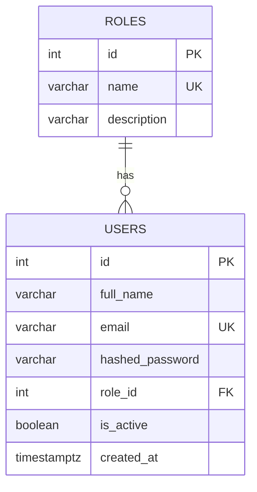

# WorkSphere Database ER Diagram

```mermaid
erDiagram
    ROLES ||--o{ USERS : "has"

    ROLES {
        int id PK
        varchar name UK
        varchar description
    }

    USERS {
        int id PK
        varchar full_name
        varchar email UK
        varchar hashed_password
        int role_id FK
        boolean is_active
        timestamptz created_at
    }
```
